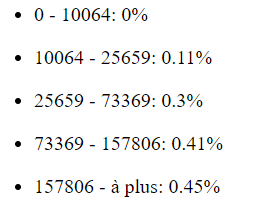

## 1.1 CreateElement API

React.createElement est l’api de base de React. Il nous permet de créer des éléments que l’on peut accrocher à notre document (DOM)

```javascript
const title = React.createElement("h1", {}, "Bienvenue sur le site Bercy");
ReactDOM.render(title, document.querySelector("#app"));
console.log(title);
```

Quelle est la difference avec

```javascript
document.querySelector("#app").innerHTML =
  "<h1>Bienvenue sur le site Bercy</h1>";
```

Pour connaitre la difference, comparons les deux blocs de code ci-dessous:

**Rendu sans React**

```javascript
let compteur = 0;

function renduSansReact() {
  document.querySelector("#app").innerHTML =
    "<h1>Bienvenue sur le site Bercy <span> " + compteur + "</h1>";
}
renduSansReact();
window.setInterval(() => {
  compteur++;
  renduSansReact();
}, 1000);
```

**Rendu avec React**

```javascript
let compteur = 0;

function renduAvecReact() {
  const title = React.createElement(
    "h1",
    {},
    "Bienvenue sur le site Bercy",
    React.createElement("span", {}, compteur)
  );
  ReactDOM.render(title, document.querySelector("#app"));
}
renduAvecReact();
window.setInterval(() => {
  compteur++;
  renduAvecReact();
}, 1000);
```

## 1.2 Qu'est ce que le jsx

C'est une syntaxe qui nous permet de décrire du React un peu plus simplement sans utiliser React.createElement. Elle n'est pas comprise par le navigateur.
_Le code ci-dessus deviendrait :_

```jsx
const title = <h1>Bienvenue sur le site Bercy</h1>;
```

Pour utiliser JSX nous avons besoin de **Babel**. **Babel** permet de convertir du code moderne vers du code un peu plus ancien supporté par les vieux navigateurs. Il supporte le JSX.

:mechanic: **Testons ce que fait Babel**

Copier le code jsx ci-dessus et le coller dans le traducteur babel pour observer la traduction en javascript [Traducteur Babel](https://babeljs.io/repl#?browsers=defaults%2C%20not%20ie%2011%2C%20not%20ie_mob%2011&build=&builtIns=false&spec=false&loose=false&code_lz=Q&debug=false&forceAllTransforms=false&shippedProposals=false&circleciRepo=&evaluate=false&fileSize=false&timeTravel=false&sourceType=module&lineWrap=true&presets=env%2Creact%2Cstage-2%2Cenv&prettier=false&targets=&version=7.11.1&externalPlugins=)

#### Comment ajouter Babel à notre projet?

Modifier le fichier _index.html_ pour ajouter la dependance Babel

```diff
+ <script src="https://unpkg.com/babel-standalone@6/babel.min.js" defer></script>
! <script src="app.js" type="text/babel" defer></script>
```

:mechanic: **Passons en JSX notre code de bienvenue**

```jsx
function WelcomeMessage() {
  const title = (
    <h1>
      Bienvenu sur le site de Bercy <span> Yannick</span>
    </h1>
  );
  return title;
}
// rendu dans le DOM
ReactDOM.render(WelcomeMessage(), document.querySelector("#app"));
```

[JsFiddle](https://jsfiddle.net/thies05/9nkvzase/302/)

## 1.3 La syntaxe JSX

### 1.3.1 Interpolation

Pour dynamiser le contenu de notre jsx, nous avons besoin d'injecter des variables et des expressions dans le code. Le JSX nous permet d'injecter du code javascript à travers les "moustaches"
_**{mon expression javascript}**_

:mechanic: **Ajoutons le nom du user à notre message de bienvenue**
&

```jsx
const userName = "Yannick";

function WelcomeMessage() {
  const title = (
    <h1>
      Bienvenu sur le site de Bercy <span> {userName}</span>
    </h1>
  );
  return title;
}
// rendu dans le DOM
ReactDOM.render(WelcomeMessage(), document.querySelector("#app"));
```

[Jsfiddle](https://jsfiddle.net/thies05/9nkvzase/305/)

> Tous les elements HTML5 sont utilisables de manière equivalente dans la syntaxe JSX.

### 1.3.2 Les attributs: _id_, _classeName_, _children_

- **id**: Permet d'identifier de manière unique un element JSX. Il est l'equivalent de l'attribut id des elements du DOM.
- **className**: Il permet d'appliquer du style à notre element. Il correspond à l'attribut class du DOM.
- **children**: Il correspond à l'element fils d'un element jsx. Il peut être de type jsx, primitif ou une expression javascript.

> - Il existe d'autres attribut: checked, value, tabindex ....
> - La valeur des attributs passés au elements JSX sont appellés des Props.

```jsx
const userName = "Yannick";

function WelcomeMessage() {
  const className = "bercy-bienvenue-msg";
  const title = (
    <h1 id="unique-id" className={className}>
      Bienvenu sur le site de Bercy <span> {userName}</span>
    </h1>
  );
  return title;
}
// rendu dans le DOM
ReactDOM.render(WelcomeMessage(), document.querySelector("#app"));
```

[Jsfiddle](https://jsfiddle.net/thies05/9nkvzase/311/)

### 1.3.2 Les basiles auto fermentes

Quand l'element jsx n'a pas de children, la balise peut être auto-fermante

```diff
- const title = <h1 id={uuid()} className={className} children={message}></h1>;
+ const title = <h1 id={uuid()} className={className} children={message} />;
```

## 1.3.3 Conditions

> En Jsx, _false_, _null_, _undefined_, et _true_ sont des elements valides. Ils ne sont simplement pas exploités. Ces expressions JSX produiront toutes la même chose. Ça peut être utile pour afficher des éléments React de façon conditionnelle

```jsx
function WelcomeMessage(userName) {
  const isUserConnected = userName !== "";
  return (
    <div>
      {isUserConnected && (
        <header>Bienvenue sur le simulateur Bercy {userName}</header>
      )}
      <em>
        Bercy est projet proposé par C.Merlen qui permet de faire une estimation
        de vos impots
      </em>
    </div>
  );
}
// rendu dans le DOM
ReactDOM.render(WelcomeMessage(""), document.querySelector("#app"));
```

[Jsfiddle](https://jsfiddle.net/thies05/9nkvzase/336/)

On peut aussi utiliser les condtions ternaires.

####:weight_lifting_man: Exercice 1
**Afficher le montant d'imposition**
Ecrire une fonction **DisplayImpot** qui reçoit en paramètre le montant de vos impôts et affiche les messages suivants.

- Si le montant des impôts est supérieur à 0 : _« Le montant de vos impôts est :xxxxx »_
- Sinon on affiche vous n’êtes pas imposables.

[Jsfiddle](https://jsfiddle.net/thies05/cx93rhLg/15/)

## 1.3.5 Boucles

```jsx
function DisplayTranchesImpot({ tranches }) {
  const tauxInpositions = tranches.map((tranche) => (
    <div key={tranche.id}>{tranche.tauxImposition}</div>
  ));
  return tauxInpositions;
}
```

[Jsfiddle](https://jsfiddle.net/thies05/9nkvzase/6/)

## 1.3.4 React fragment

En React, il est courant pour un composant de renvoyer plusieurs éléments. Les fragments nous permettent de grouper une liste d’enfants sans ajouter de nœud supplémentaire au DOM.

```jsx
function RenderFragment() {
  return (
    <React.Fragment>
      <ElementA />
      <ElementB />
      <ElementC />
    </React.Fragment>
  );
}
```

**où bien**

```jsx
function RenderFragment() {
  return (
    <>
      <ElementA />
      <ElementB />
      <ElementC />
    </>
  );
}
```

####:weight_lifting_man: Exercice 2
**Afficher les tranches d'imposition avec leur details**

- Nous possédons une methode qui permet de retourner les tranches d'imposition _**getAllTranches()**_
- **Travail à Faire**

  - Afficher les tranches d'imposition avec les details comme ci-dessous:
  - Pensez à eviter ce message: **Warning: Each child in a list should have a unique "key"**

    

    **Code de base**

    ```javascript
    function getAllTranchesAsync() {
      return [
        {
          id: 1,
          tauxImposition: 0.0,
          limiteInf: 0,
          limiteSup: 10064,
        },
        {
          id: 2,
          tauxImposition: 0.11,
          limiteInf: 10064,
          limiteSup: 25659,
        },
        {
          id: 3,
          tauxImposition: 0.3,
          limiteInf: 25659,
          limiteSup: 73369,
        },
        {
          id: 4,
          tauxImposition: 0.41,
          limiteInf: 73369,
          limiteSup: 157806,
        },
        {
          id: 5,
          tauxImposition: 0.45,
          limiteInf: 157806,
        },
      ];
    }

    function AffichertranchesImposition() {
      // Votre code ICI
    }

    // rendu dans le DOM
    ReactDOM.render(
      AffichertranchesImposition(),
      document.querySelector("#app")
    );
    ```

    <!-- [Solution boucle](https://jsfiddle.net/thies05/9nkvzase/341/) -->

[Pour aller plus loin](https://fr.reactjs.org/docs/introducing-jsx.html)
